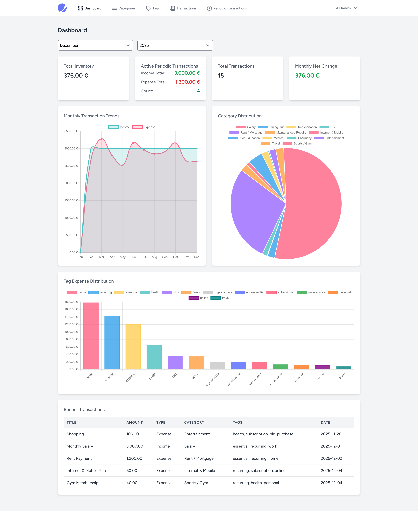
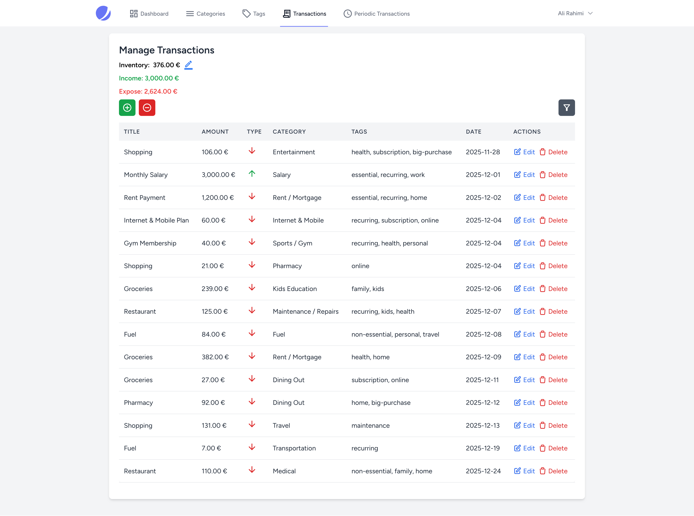
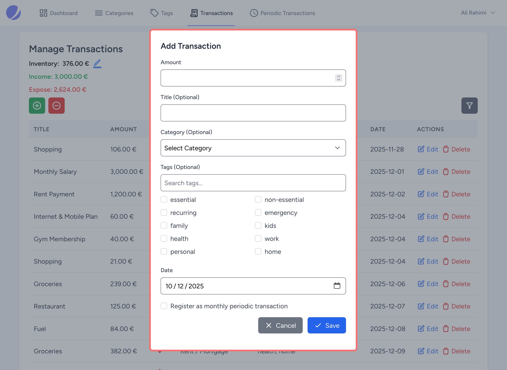

# 💰 Family Financing
### 🧾 Personal Income & Expense Manager (Laravel + Livewire)

A small, lightweight Laravel app for tracking **family income & expenses**.  
Built as a personal side-project for simple daily finance management — feel free to use it! 😊

---

## 📷 Screenshots




---

## ✨ What can it do?
✅ Track **income & expense transactions**  
✅ Organize by **categories** and **tags**  
✅ Define **periodic (recurring) transactions**  
✅ View a **live dashboard with charts**  
✅ Quick setup with **SQLite** (but portable to MySQL/Postgres)

---

## 🧩 Key Features
- 📝 **Transactions**
  - Record incomes/expenses with **title, amount, date**
  - Assign **one category** + **multiple tags**
- 🗂️ **Categories & Tags**
  - Keep your reporting clean and structured
- 🔁 **Periodic Transactions**
  - Model recurring payments/incomes (rent, salary, subscriptions, etc.)
- 📊 **Dashboard**
  - Visual summaries & charts (Livewire components)
- 🪶 **Lightweight by Design**
  - Minimal setup, fast dev experience

---

## 🛠 Tech Stack
- **Backend:** Laravel (Eloquent)
  - Models: `Transaction`, `Category`, `Tag`, `PeriodicTransaction`, `Inventory`
- **Frontend:** Livewire + Vite + Tailwind CSS
- **Database:** SQLite (default) — compatible with MySQL/Postgres

---

## ⚡ Quick Start (Development)

```bash
# 1) Clone & enter
git clone https://github.com/alirahimi818/family-financing.git
cd family-financing

# 2) Install backend deps
composer install

# 3) Install frontend deps
npm install

# 4) Setup environment
cp .env.example .env

# 5) Generate app key
php artisan key:generate

# 6) Run migrations (optionally seed)
php artisan migrate
# php artisan db:seed

# 7) Run dev server
npm run dev
php artisan serve
```

Now open: **[http://localhost:8000](http://localhost:8000)** 🚀

---

## 🗃 Database Notes

By default the project uses SQLite for fast local setup.
Make sure your `.env` points to it:

```env
DB_CONNECTION=sqlite
DB_DATABASE=/absolute/path/to/database/database.sqlite
```

Want MySQL/Postgres? Just change `.env` and rerun migrations.

---

## 🧭 Usage Flow (Super Simple)

1. ➕ Create your **Categories**
2. 🏷️ Add some **Tags**
3. 🧾 Start adding **Transactions**
4. 🔁 Define **Periodic Transactions** if you need recurring stuff
5. 📊 Visit the **Dashboard** and enjoy your summaries 🎉

---

## 🤝 Contributing

This is a personal project, but PRs are welcome!

* Fork it 🍴
* Create a new branch 🌿
* Commit your changes ✅
* Open a PR 🚀

---

## 📄 License

MIT — do whatever you want, just keep the credit. 🙌

---

## 🌟 Ideas for Future (Optional Roadmap)

If I ever continue this project, these might be cool:

* 📤 Export reports (CSV / PDF)
* 🌍 Multi-currency support
* 👥 Multi-user / family members
* 🌙 Dark mode
* ☁️ Backup & restore

---

Made with ☕ + ❤️ using Laravel & Livewire.

